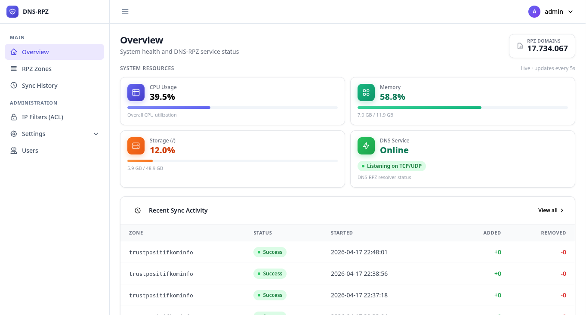

# dns-rpz
[](LICENSE)
DNS resolver kustom dengan RPZ (Response Policy Zone), dibangun menggunakan Go.

## Latar Belakang

### Mengapa dibangun sendiri

Jaringan kami diwajibkan untuk menerapkan pemblokiran domain sesuai daftar Trustpositif Kominfo,
yang didistribusikan sebagai RPZ zone melalui AXFR. Daftar ini saat ini berisi **~17,7 juta domain**
dan terus bertambah setiap harinya.

### Panduan resmi dari Komdigi

Komdigi (Kementerian Komunikasi dan Digital) menerbitkan *Panduan Sinkronisasi dan Konfigurasi
RPZ BIND* sebagai acuan implementasi wajib bagi ISP. Berikut spesifikasi minimum yang mereka
rekomendasikan:


| No | Jenis | Spesifikasi |
|---|---|---|
| 1 | Hardware Server | Minimal 4 core CPU, **minimal 8 GB RAM**, 50 GB Storage |
| 2 | Operating System | Linux (Debian, Ubuntu Server, dll.) |
| 3 | Paket Instalasi | BIND9 |
| 4 | Network | IP Publik Dedicated |

**8 GB RAM hanya untuk menjalankan BIND9 dengan RPZ.** Angka ini bukan kebetulan — ini memang
kebutuhan nyata BIND9 saat memuat jutaan entri RPZ ke memori. Panduan tersebut ditulis tanpa
pengujian beban aktual di skala Trustpositif yang sesungguhnya (~7,8 juta domain). Pada praktiknya,
server dengan 8 GB RAM pun bisa mengalami OOM saat AXFR besar berlangsung bersamaan dengan
lonjakan query.

Kami sudah mencoba mengikuti panduan ini dan menemukan masalah yang tidak tercantum di dokumen:

**BIND 9 dengan RPZ**
- Memuat ~7,8 juta entri RPZ menyebabkan konsumsi memori mendekati 8 GB — tepat di batas panduan
- CPU melonjak saat zone transfer dan reload — server menjadi tidak responsif
- Proses reload zone (AXFR) memblokir query selama beberapa menit
- Konfigurasi sangat kompleks dan rapuh pada skala ini

**Unbound dengan RPZ**
- Masalah memori serupa — implementasi RPZ Unbound memuat semua record ke memori
  dalam format yang dioptimalkan untuk DNS umum, bukan untuk pencarian blocklist massal
- Pada 8 juta entri, RSS melebihi RAM yang tersedia dan proses di-kill oleh OOM killer
- Reload membutuhkan restart penuh, menyebabkan downtime layanan

Kedua tool tersebut adalah DNS server serba guna yang sangat baik, namun tidak dirancang untuk
masalah spesifik penegakan blocklist dengan jutaan entri. Struktur data internalnya membawa
overhead yang signifikan per record, yang menumpuk pada skala ini.

**Keputusan membangun dns-rpz:**

Masalah yang perlu kami selesaikan sangat spesifik: diberikan nama domain yang di-query,
apakah ada di blocklist? Jika ya, terapkan kebijakan RPZ. Jika tidak, teruskan ke upstream.
Pada dasarnya ini hanyalah operasi pencarian hashmap.

Resolver yang dibuat khusus, menyimpan semua entri dalam satu `map[string]string` di Go
yang dimuat dari PostgreSQL saat startup, menyelesaikan masalah dengan overhead minimal:

| Metrik | BIND 9 / Unbound | dns-rpz |
|---|---|---|
| Memori pada 7,8 juta entri | ~8 GB (minimum versi Komdigi, OOM pada praktiknya) | ~800 MB |
| Waktu startup / load RPZ | 3–10 menit | < 35 detik |
| CPU saat reload zone | Spike 100%, query terganggu | Goroutine background, atomic swap |
| Kompleksitas konfigurasi | named.conf / unbound.conf dengan direktif RPZ | Satu file `.env` |
| Observabilitas | Butuh tooling log eksternal | Structured logging + audit log built-in |
| Deployment | Package manager / manual | `make deploy` — satu binary statis via SCP |

Inti pemikirannya: tool yang fokus mengerjakan satu hal dengan baik lebih unggul daripada
tool serba guna yang kesulitan menangani kasus yang memang bukan rancangannya.

---

## Cara Kerja

```
Query dari client
    │
    ▼
Cek ACL ── tidak diizinkan ──► REFUSED
    │
    ▼
Pencarian RPZ di in-memory index
    ├── cocok (exact) ──► terapkan aksi RPZ (NXDOMAIN / NODATA / walled garden)
    ├── cocok (wildcard) ──► terapkan aksi RPZ
    └── tidak cocok
            │
            ▼
        Cek response cache
            ├── cache hit ──► kembalikan response cache (TTL disesuaikan)
            └── cache miss
                    │
                    ▼
                Upstream resolver (8.8.8.8, 1.1.1.1, dll.)
                    │
                    ▼
                Simpan ke cache ──► kembalikan ke client
```

**Alur startup:**

1. Muat bootstrap config dari file `.env`
2. Koneksi ke PostgreSQL (pgxpool)
3. Jalankan migrasi schema (idempotent)
4. Muat CIDR yang aktif ke dalam ACL
5. Muat semua record RPZ ke in-memory hashmap (~7,8 juta entri dalam ~800 MB)
6. Jalankan DNS server (UDP + TCP pada port 53)
7. Jalankan scheduler sinkronisasi AXFR (periodic pull dari RPZ master)

**Alur sinkronisasi (AXFR):**

- Scheduler berjalan setiap `sync_interval` detik (default: 24 jam)
- Transfer AXFR penuh dari master → upsert ke PostgreSQL
- Penggantian in-memory index secara atomik (tidak ada downtime saat sync)
- Fallback ke master IP sekunder jika master utama gagal

---

## Arsitektur

```
cmd/
├── dns-rpz/
│   ├── main.go       — wiring: config, DB, index, ACL, upstream, server, SIGHUP handler
│   └── logger.go     — slog multiHandler (stdout + file tee), LevelVar untuk ubah level runtime
└── dns-rpz-dashboard/
    ├── main.go       — wiring: config, DB, syncer, HTTP server
    └── logger.go     — slog logger untuk dashboard

internal/
├── dns/
│   ├── server.go     — DNS query handler (penegakan RPZ, audit log, cek ACL)
│   ├── index.go      — in-memory hashmap thread-safe (RWMutex, 8 juta+ entri)
│   ├── upstream.go   — upstream pool (strategi roundrobin/random/race, TCP fallback)
│   └── cache.go      — TTL-aware LRU response cache (hashicorp/golang-lru/v2)
├── api/
│   ├── router.go     — HTTP server, routing, middleware setup, per-page template renderer
│   ├── auth.go       — login/logout, session management (cookie + PostgreSQL)
│   ├── middleware.go — session check, role check (admin), CSRF, rate limit, security headers
│   ├── stats.go      — handler dashboard overview (zone count, record count, recent sync)
│   ├── zones.go      — CRUD zone, toggle, trigger sync, record list, sync history per zone
│   ├── ipfilters.go  — CRUD IP filter/CIDR (ACL)
│   ├── synchistory.go — riwayat sinkronisasi global
│   ├── settings.go   — baca/simpan app settings
│   └── users.go      — CRUD user, toggle, change password (profile)
├── store/
│   ├── db.go         — koneksi pgxpool, migrasi schema
│   ├── zone.go       — CRUD RPZ zone
│   ├── record.go     — upsert/delete record RPZ (bulk)
│   ├── settings.go   — app settings (key/value di DB)
│   ├── ipfilter.go   — manajemen CIDR untuk ACL
│   ├── user.go       — CRUD user + session
│   └── synchistory.go — log riwayat sinkronisasi AXFR
└── syncer/
    └── syncer.go     — AXFR client, scheduler sinkronisasi zone

assets/
├── templates/        — HTML templates (base layout + per-page)
└── static/           — CSS, JS (Alpine.js, htmx, Flowbite)

config/
└── config.go         — parser .env, BootstrapConfig, AppSettings

db/
├── schema.sql        — schema PostgreSQL (embedded)
└── seed.go           — seed pengaturan default
```

**Tech stack:**

| Komponen | Library |
|---|---|
| DNS server + AXFR client | `github.com/miekg/dns` |
| PostgreSQL driver + pool | `github.com/jackc/pgx/v5` (pgxpool) |
| Response cache | `github.com/hashicorp/golang-lru/v2` |
| HTTP framework (dashboard) | `github.com/gin-gonic/gin` |
| Frontend interaktif | Alpine.js v3 (CSP) + htmx |
| Config | Parser `.env` pure Go (tanpa dependensi eksternal) |
| Logging | `log/slog` (stdlib) |

---

## Kebutuhan Sistem

- Go 1.25+
- PostgreSQL 14+
- Linux (systemd untuk deployment production)
- Akses SSH ke server production (untuk `make deploy`)

> **Tested in production:** Debian 13 (Trixie)

---

## Konfigurasi

Salin contoh config dan isi nilainya:

```bash
cp dns-rpz.conf.example dns-rpz.conf
```

### Bootstrap config (`dns-rpz.conf`)

Satu file `.env` yang sama dipakai oleh kedua binary (`dns-rpz-dns` dan `dns-rpz-dashboard`).
Hanya berisi nilai minimum yang diperlukan sebelum koneksi database tersedia.
Semua pengaturan lainnya dikelola via dashboard dan disimpan di DB.
Perubahan membutuhkan **restart penuh**.

| Key | Default | Keterangan |
|---|---|---|
| `DATABASE_DSN` | *(wajib)* | Connection string PostgreSQL |
| `DATABASE_MAX_CONNS` | `20` | Maksimal koneksi DB dalam pool |
| `DATABASE_MIN_CONNS` | `2` | Minimal koneksi DB idle |
| `DNS_ADDRESS` | `0.0.0.0:53` | Alamat listen DNS server (UDP+TCP). Wajib untuk `dns-rpz-dns` |
| `LOG_LEVEL` | `info` | Nilai awal log level sebelum pengaturan DB dimuat. Setelah DB terhubung, `log_level` dari dashboard akan menggantikan nilai ini |

### App settings (disimpan di PostgreSQL)

Pengaturan berikut dikelola melalui halaman **Settings** di dashboard dan disimpan di tabel `settings` PostgreSQL. Perubahan langsung aktif tanpa restart, kecuali yang ditandai.

**Sync & Mode**

| Key | Default | Keterangan |
|---|---|---|
| `mode` | `slave` | Mode sinkronisasi global: `slave` (pull AXFR dari master) / `master` |
| `master_ip` | — | IP master AXFR (mode slave) |
| `master_port` | `53` | Port master AXFR |
| `tsig_key` | — | Nama TSIG key (opsional) |
| `tsig_secret` | — | TSIG secret base64 (opsional) |
| `sync_interval` | `86400` | Interval sinkronisasi otomatis dalam detik (minimum: 60). **Hot-reload** (tidak perlu restart) |

**DNS**

| Key | Default | Keterangan |
|---|---|---|
| `dns_upstream` | `8.8.8.8:53,8.8.4.4:53` | Upstream resolver — satu IP per baris di dashboard, port 53 otomatis. Gunakan `ip:port` untuk port lain. **Hot-reload** via SIGHUP ke `dns-rpz-dns` |
| `dns_upstream_strategy` | `roundrobin` | Strategi distribusi query upstream: `roundrobin` / `random` / `race`. **Hot-reload** via SIGHUP |
| `rpz_default_action` | `nxdomain` | Aksi default saat entri RPZ tidak punya CNAME: `nxdomain` / `nodata`. **Hot-reload** via SIGHUP |
| `dns_cache_size` | `100000` | Jumlah entri cache response upstream (0 = nonaktif). **Memerlukan restart** agar berlaku |
| `dns_audit_log` | `false` | Log setiap query (client+nama+type+result). **Hot-reload** via SIGHUP |

**Web & System**

| Key | Default | Keterangan |
|---|---|---|
| `web_port` | `8080` | Port listen dashboard HTTPS. Service `dns-rpz-http` **restart otomatis** saat disimpan |
| `timezone` | `UTC` | Timezone sistem Linux (format IANA, contoh: `Asia/Jakarta`). Diterapkan via `timedatectl` saat save dan startup |

**Logging**

| Key | Default | Keterangan |
|---|---|---|
| `log_level` | `info` | `debug` / `info` / `warn` / `error`. **Hot-reload** via SIGHUP ke kedua service |
| `log_format` | `text` | Format output log: `text` / `json`. **Hot-reload** via SIGHUP |
| `log_file` | `false` | Tulis log ke file selain stdout. **Hot-reload** via SIGHUP |
| `log_file_path` | `/var/log/dns-rpz/dns-rpz.log` | Path file log (jika `log_file=true`). **Hot-reload** via SIGHUP |
| `log_rotate` | `false` | Generate konfigurasi `/etc/logrotate.d/dns-rpz` secara otomatis |
| `log_rotate_size` | `100M` | Ukuran file sebelum dirotasi (contoh: `100M`, `1G`) |
| `log_rotate_keep` | `7` | Jumlah arsip rotasi yang disimpan |

Pengaturan per-zone (master IP, TSIG, interval sync, dll.) juga dikelola di tabel `rpz_zones`
dan dapat diedit di halaman detail zone.

---

## Instalasi

### Build

```bash
make build
# output: bin/dns-rpz (linux/amd64)
```

### Deploy ke production

```bash
make deploy    # build + scp ke server (atomik: upload ke .new, lalu mv)
make restart   # deploy + systemctl restart + tampilkan 15 baris log terakhir
```

### Systemd service

```ini
# /etc/systemd/system/dns-rpz.service
[Unit]
Description=DNS RPZ Server
After=network.target postgresql.service
Wants=postgresql.service

[Service]
Type=simple
User=root
WorkingDirectory=/opt/dns-rpz
ExecStart=/opt/dns-rpz/dns-rpz /opt/dns-rpz/dns-rpz.conf
ExecReload=/bin/kill -HUP $MAINPID
Restart=on-failure
RestartSec=5
LimitNOFILE=65536

[Install]
WantedBy=multi-user.target
```

```bash
systemctl daemon-reload
systemctl enable --now dns-rpz
```

---

## Operasional

### Reload tanpa restart (SIGHUP)

```bash
systemctl reload dns-rpz
```

Yang ikut di-reload saat `systemctl reload dns-rpz-dns`:
- `log_level` — diterapkan langsung tanpa gangguan koneksi
- `log_format`, `log_file`, `log_file_path` — logger di-swap secara atomik
- `dns_audit_log` — di-toggle secara atomik
- `rpz_default_action` — diterapkan secara atomik tanpa downtime
- Daftar CIDR ACL — dimuat ulang dari PostgreSQL
- RPZ index — reload penuh dari PostgreSQL (atomic swap, tanpa downtime)
- `dns_upstream` + `dns_upstream_strategy` — upstream pool di-swap secara atomik

Yang **masih butuh restart penuh**: `DNS_ADDRESS`, `DATABASE_DSN`, `dns_cache_size` (cache dialokasi saat startup), `TLS_CERT_FILE`, `TLS_KEY_FILE`

> **`web_port`** tidak butuh restart manual — saat disimpan via dashboard, service `dns-rpz-http` restart otomatis.

### Aktifkan/nonaktifkan audit log saat runtime

Audit log dikontrol via dashboard: **Settings → DNS → DNS Audit Log**. Perubahan disimpan ke DB
dan service `dns-rpz-dns` di-signal otomatis untuk menerapkan setting baru tanpa restart.

Atau manual via SIGHUP setelah mengubah nilai di DB:

```bash
systemctl reload dns-rpz-dns
```

### Melihat log

```bash
# Live log
journalctl -u dns-rpz -f

# Live, hanya audit
journalctl -u dns-rpz -f | grep audit

# Live, hanya yang diblokir
journalctl -u dns-rpz -f | grep result=blocked

# N baris terakhir
journalctl -u dns-rpz --no-pager -n 50

# Statistik: allowed vs blocked (5 menit terakhir)
journalctl -u dns-rpz --since '5 minutes ago' \
  | grep audit \
  | awk '{for(i=1;i<=NF;i++) if($i~/result=/) print $i}' \
  | sort | uniq -c | sort -rn
```

### Rotasi log

Konfigurasi logrotate dikelola via dashboard: **Settings → General → Logging**.
Aktifkan toggle *Log Rotate*, atur ukuran file dan jumlah arsip, lalu klik *Save Logging Settings*.
Dashboard akan otomatis menulis (atau menghapus) file `/etc/logrotate.d/dns-rpz` sesuai pengaturan.

Contoh config yang di-generate:

```
/var/log/dns-rpz/dns-rpz.log {
    daily
    size 100M
    rotate 7
    compress
    delaycompress
    missingok
    notifempty
    copytruncate
    su root adm
}
```

> **Estimasi storage jika audit log aktif:** ~1,5 GB/hari pada 10 juta query/hari.
> Kurangi *Rotate Keep* menjadi `3` di dashboard jika storage terbatas.

### Hapus log file

Log file dapat di-truncate (dikosongkan) via dashboard: **Settings → General → Logging → Clear Log File**.
Tombol tersedia di bagian *Log File Actions*. Hanya aktif jika *Log File* diaktifkan.

---

## Aksi RPZ

| CNAME target di zone | Aksi dns-rpz | Response DNS |
|---|---|---|
| `.` | NXDOMAIN | Domain tidak ada |
| `*.` | NODATA | Nama ada, tapi tidak ada record untuk type yang diminta |
| `walled.garden.` | Redirect | CNAME ke walled garden |
| *(kosong / tanpa CNAME)* | Fallback ke `rpz_default_action` (setting DB) | NXDOMAIN atau NODATA |

---

## Catatan Performa (pada 8 juta entri)

| Metrik | Nilai |
|---|---|
| Memori (index + proses) | ~800 MB |
| Waktu startup / load index | ~25–35 detik |
| Latensi lookup DNS (RPZ hit) | < 1 ms (in-memory hashmap) |
| Latensi lookup DNS (pass-through, cache hit) | < 1 ms |
| Latensi lookup DNS (pass-through, cache miss) | 3–10 ms (upstream RTT) |
| Estimasi hit rate cache pada 10 juta/hari | 60–80% |
| Pengurangan panggilan upstream oleh cache | ~2,5 juta/hari (dari 10 juta) |

---

## Makefile Targets

```bash
make build          # compile dns-rpz (DNS server) dan dns-rpz-dashboard untuk linux/amd64
make deploy         # build + upload kedua binary ke server
make restart        # deploy + restart dns-rpz (DNS server) + tampilkan log
make restart-dns    # deploy + restart dns-rpz saja
make restart-http   # deploy + restart dns-rpz-dashboard saja
make install-services # install file systemd service ke server
```

---

## Dashboard



Dashboard web berjalan di atas **HTTPS** (selalu aktif, tidak dapat dinonaktifkan). Port default `8080`, dapat diubah via halaman Settings di dashboard (disimpan di DB).

Akses melalui browser: `https://<ip-server>:<port>` setelah service `dns-rpz-dashboard` aktif.

> **Sertifikat self-signed:** Saat pertama kali berjalan, `dns-rpz-dashboard` otomatis men-generate sertifikat TLS self-signed (ECDSA P-256, berlaku 10 tahun) di `./certs/server.crt` dan `./certs/server.key`. Browser akan menampilkan peringatan keamanan — ini normal untuk sertifikat self-signed. Klik *Advanced → Proceed* untuk melanjutkan. Jika ingin menggunakan sertifikat resmi (misalnya dari Let's Encrypt), arahkan `TLS_CERT_FILE` dan `TLS_KEY_FILE` di `dns-rpz.conf` ke file yang sesuai.

### Fitur

#### Overview
Halaman utama menampilkan ringkasan kondisi sistem secara real-time:
- Total zone RPZ dan jumlah zone yang aktif
- Total record RPZ di seluruh zone aktif
- 10 riwayat sinkronisasi terbaru (zona, status, waktu, jumlah record ditambah/dihapus)

#### Manajemen Zone RPZ (`/zones`)
- Daftar semua zone RPZ beserta status (aktif/nonaktif), jumlah record, dan waktu sync terakhir
- Tambah zone baru: nama zone, master IP primer & sekunder, port, TSIG key (opsional)
- Edit konfigurasi zone yang sudah ada
- Aktifkan / nonaktifkan zone tanpa menghapus data record
- Hapus zone beserta seluruh record-nya
- Trigger sinkronisasi AXFR manual per zone
- Lihat detail zone: semua record RPZ (nama domain + aksi CNAME)
- Lihat riwayat sinkronisasi per zone

#### IP Filters / ACL (`/ip-filters`)
- Daftar semua CIDR yang diizinkan menggunakan resolver
- Tambah CIDR baru (IPv4 atau IPv6, format CIDR atau single IP)
- Aktifkan / nonaktifkan CIDR tanpa menghapus entri
- Hapus CIDR dari ACL
- Perubahan ACL berlaku langsung — tidak perlu reload/restart DNS server

#### Riwayat Sinkronisasi (`/sync-history`)
- Log seluruh operasi AXFR dari semua zone secara kronologis
- Informasi per entri: nama zone, status (success/failed), waktu mulai & selesai, durasi, jumlah record ditambah dan dihapus

#### Pengaturan (`/settings`)
Dibagi menjadi 4 section, masing-masing memiliki tombol **Save** tersendiri dan berlaku langsung:

| Section | Field | Efek saat disimpan |
|---|---|---|
| **Sync** | Mode (master/slave), Master IP & port, TSIG key/secret, Sync interval | Interval baru langsung aktif tanpa restart |
| **DNS** | Upstream resolver, strategi (roundrobin/random/race), RPZ default action (nxdomain/nodata), DNS cache size, Audit log | Upstream + action + audit log di-reload atomik via SIGHUP; cache size berlaku setelah restart |
| **Web Server** | Port dashboard HTTPS | Service `dns-rpz-http` restart otomatis |
| **System** | Timezone Linux (IANA format) | Diterapkan via `timedatectl` |
| **Logging** | Log level, format (text/json), log file toggle, path, logrotate toggle, ukuran rotate, jumlah arsip | Logger di-reload atomik via SIGHUP ke kedua service; logrotate config ditulis otomatis ke `/etc/logrotate.d/dns-rpz` |

Di bagian Logging tersedia juga tombol **Clear Log File** untuk mengosongkan file log aktif tanpa perlu SSH ke server.

#### Manajemen Pengguna (`/users`) *(admin only)*
- Daftar semua akun pengguna dashboard
- Tambah pengguna baru dengan role `admin` atau `viewer`
- Edit data pengguna (username, role)
- Aktifkan / nonaktifkan akun
- Hapus akun pengguna
- Viewer hanya bisa membaca; aksi tulis (tambah/edit/hapus/trigger sync) membutuhkan role admin

#### Profil & Ganti Password (`/profile`)
- Setiap pengguna yang sudah login dapat mengganti password-nya sendiri
- Validasi password lama sebelum menyimpan password baru

### Keamanan Dashboard

| Mekanisme | Detail |
|---|---|
| Transport | **HTTPS selalu aktif** — TLS self-signed ECDSA P-256 di-generate otomatis jika belum ada |
| Autentikasi | Session cookie berbasis token acak, disimpan di tabel PostgreSQL |
| Rate limiting | Login dibatasi untuk mencegah brute-force |
| CSRF protection | Token CSRF pada semua form POST |
| Security headers | `X-Frame-Options`, `X-Content-Type-Options`, `Content-Security-Policy`, dll. |
| Role-based access | Admin: akses penuh; Viewer: read-only |
| Password hashing | bcrypt |

### Menjalankan Dashboard

```bash
# Build binary dashboard
make build-http

# Deploy ke server
make restart-http
```

```ini
# /etc/systemd/system/dns-rpz-http.service
[Unit]
Description=DNS RPZ Dashboard
After=network.target postgresql.service
Wants=postgresql.service

[Service]
Type=simple
User=root
WorkingDirectory=/opt/dns-rpz
ExecStart=/opt/dns-rpz/dns-rpz-dashboard /opt/dns-rpz/dns-rpz.conf
Restart=on-failure
RestartSec=5

[Install]
WantedBy=multi-user.target
```

### Tech stack dashboard

| Komponen | Library / Tool |
|---|---|
| HTTP framework | `github.com/gin-gonic/gin` |
| Template engine | `html/template` (stdlib) + per-page renderer |
| Frontend interaktif | Alpine.js v3 (CSP build) + htmx |
| Styling | Flowbite CSS + custom design system |
| Kompresi | gzip middleware |

---

## Lisensi

Proyek ini dilisensikan di bawah [MIT License](LICENSE).

Bebas digunakan, dimodifikasi, dan didistribusikan — termasuk untuk keperluan komersial — selama menyertakan pemberitahuan lisensi dan hak cipta asli.

